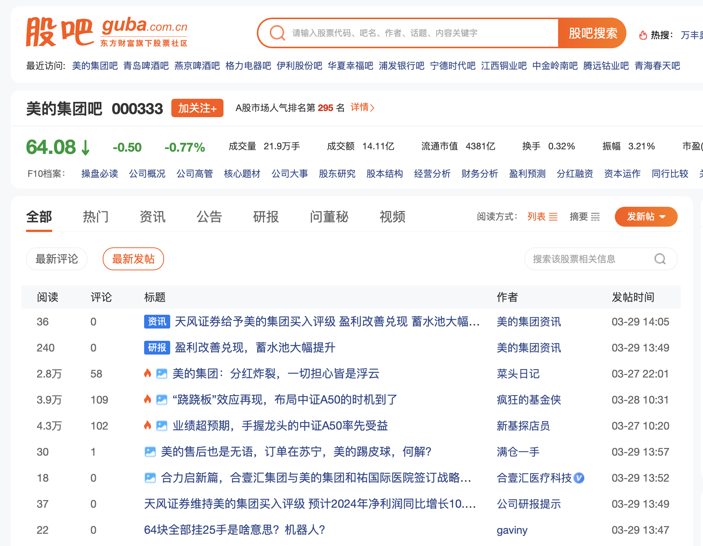
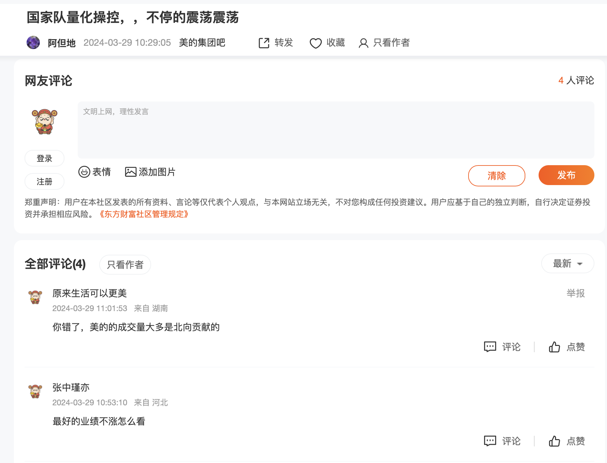
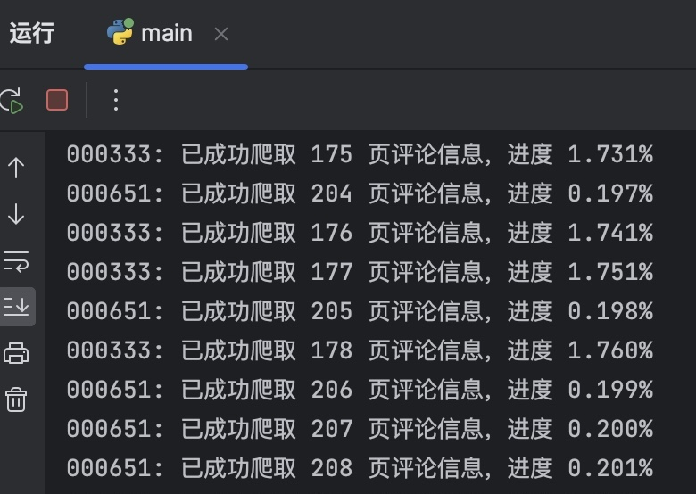
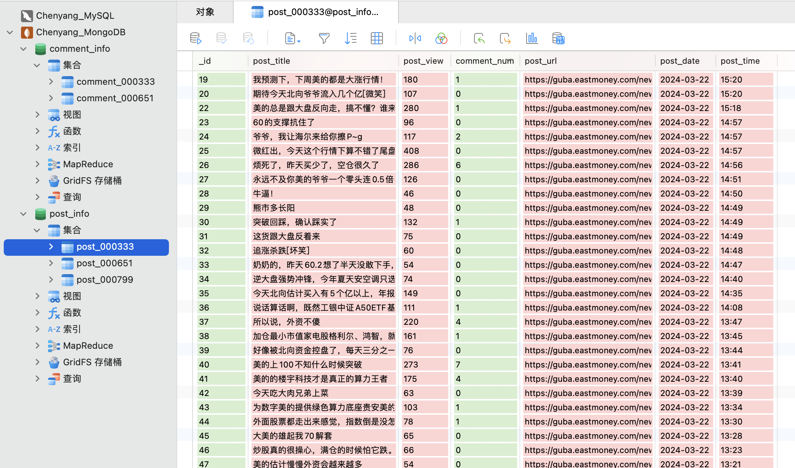
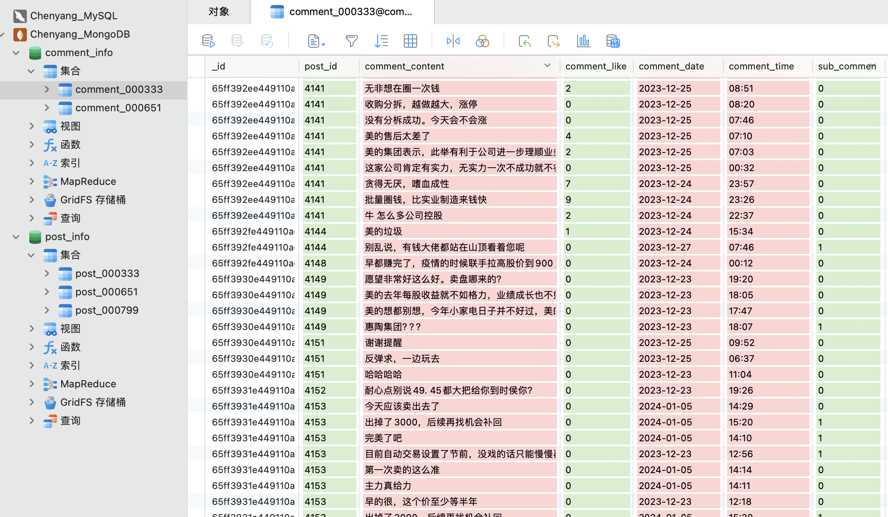

# 东方财富股吧爬虫

## 项目介绍

该项目使用 selenium 模拟用户操作抓取股吧 **发帖** 和 **评论** 数据（允许多线程同时抓取多支股票的相关信息），并将抓取到的数据储存到 MongoDB 中，方便后续使用。

附加说明：非科班新手第一次写爬虫，代码效率一般（比如未使用 redis 做消息队列等等），适合新手入门或小规模爬取（本地环境运行时，爬取百万条及以下数据的耗时尚可接受）。以后若有能力与时间会对代码进行迭代维护，提高爬取效率，同时欢迎各位大佬提 [issue](https://github.com/zcyeee/EastMoney_Crawler/issues)。

## 主要功能

1. 爬取指定股票股吧中的**发帖信息**，包括帖子标题，浏览量，评论数，帖子链接，发帖时间 (YYYY-MM-DD, HH: MM)，发帖人，以 `post_XXXXXX` 为集合名储存到 MongoDB 中。

2. 爬取指定时间范围中股吧帖子下的**评论信息**，包括评论内容，是一级或二级评论，点赞数，发帖时间 (YYYY-MM-DD, HH: MM)，以 `comment_XXXXXX` 为集合名储存到 MongoDB 中。

3. 可以通过 `post_XXXXXX` 下的 `_id` 与 `comment_XXXXXX` 下的 `post_id` 建立映射关系，对帖子标题和评论内容进行匹配。

## 文件介绍

- `main.py` : 主程序，直接在里面调用函数即可开始抓取数据。

- `crawler.py` : 爬虫主体，包含了 `PostCrawler` 和 `CommentCrawler` 两个类，负责抓取帖子和评论的信息。

- `parser.py` : 解析器，包含了 `PostParser` 和 `CommentParser` 两个类，负责解析帖子和评论的网页源码。

- `mongodb.py` : 数据库接口，包含了 `MongoAPI` 类，负责建立与本地数据库的连接并实现基础操作。

- `stealth.min.js` : 一个 javascript 文件，用来抹掉 selenium 中的自动化特征。

## 爬取逻辑

### a. 爬取帖子信息

1. 设定需要爬取的股吧帖子和页数范围后，爬虫将会爬取从 `start_page` 到第 `end_page` 页的所有帖子信息，包括标题、评论个数、浏览量、发帖时间和帖子对应的跳转链接（非股吧帖子的链接将会被剔除），以 `post_XXXXXX` 为名保存到本地名为 `post_info` 的数据库中（后续爬取对应股票的评论信息需要用到这一步的数据）。

2. 注意保存的时间为发帖时间，而非更新时间。而如何确立发帖时间年份的函数集成在了 `PostParser` 类（不是通过访问帖子跳转链接获取），其中还有一些特殊情况的处理，不在此赘述。

3. 当爬取帖子到 660 页左右时，一般会被限制访问，此时程序会自动退出 `webdriver` 并重新实例一个继续爬取。（ps: 暂时只知道这个解决方法，试过清理 cookies 和更改 user-agent，并不管用orz）

### b. 爬取评论信息

1. **爬取评论信息一定要等帖子信息爬取完之后才可以进行**，因为要用到帖子对应的跳转链接，和该帖子是否有评论的信息（没有评论的帖子会从爬取列表中剔除，节省时间）。

2. 输入 `start_date` 和 `end_date` 后，会自动从集合 `post_XXXXXX` 中筛选出该时间范围内且评论数不为零的帖子链接，爬取这些帖子下的一级评论、二级评论（ `sub_comment` 为 1 代表是二级评论，0 代表一级评论）、点赞数和评论时间，以 `comment_XXXXXX` 为名保存到本地名为 `comment_info` 的数据库中。

3. 对于无法显示的违规评论，会自动略过该帖。有时帖子评论未能成功加载，则会在 0.2s 后刷新网页，若依旧加载失败，也会略过该帖子。

4. 在爬取的时候会显示爬取页数和完成进度。若爬虫中途中断，会显示需要爬取的 `_id` 范围和出错的 `id` 值，可通过 `find_by_id` 方法从上次终止的地方接着抓取评论数据。

## 使用步骤

### 1. 下载代码

可以直接 `git clone` 或 `Download ZIP` ，或者点击 [release](https://github.com/zcyeee/EastMoney_Crawler/releases) 下载。

### 2. MongoDB 安装

若没有 MongoDB，需要先下载，mac 推荐直接使用 `homebrew` 进行安装（[官网教程](https://www.mongodb.com/docs/manual/tutorial/install-mongodb-on-os-x/)）。

安装后记得在终端中启动 MongoDB，命令如下：
```
brew services start mongodb-community@5.0
```
如果 MongoDB 运行在本地计算机上，而且也没有修改端口或者添加用户名及密码，那么不需要进行任何操作；若有更改，则需在 `mongodb.py` 中修改对应参数。

最后在 MongoDB 中**创建两个名为 `post_info` 和 `comment_info` 的数据库**，分别用来储存 **发帖信息** 和 **评论信息**。

### 3. Webdriver 安装

在电脑上下载 `Chromedriver` ，版本需要与 `Chrome` 一致，安装教程见 [Chromedriver (mac)](https://zhuanlan.zhihu.com/p/657757693)，[Chromedriver (win)](https://blog.csdn.net/weixin_45109684/article/details/117650036)。

~~下载历史版本的 `Chrome` / `Chromedriver`，可以前往 [Chrome 历史版本下载](https://vikyd.github.io/download-chromium-history-version/#/)。~~（不推荐，貌似停止更新了）

下载测试版本的 `Chrome` / `Chromedriver`，可以前往 [Chrome 测试版本下载](https://googlechromelabs.github.io/chrome-for-testing/#dev)。（推荐）

ps：推荐电脑上装两个 Chrome，平时使用的那一个自动更新，而测试版专门给 webdriver 使用，可以有效避免因为浏览器自动更新导致 webdriver 需要重新下载对应版本的问题。

### 4. 运行 main.py

进入主程序 `main.py` ，安装没有安装的包，对参数进行修改（ `main.py` 中有相关参数的解释）即可开始爬取（**注意在爬取评论信息前需要先爬取发帖信息**）。

a. 爬取发帖信息参数设置示例:
```
thread1 = threading.Thread(target=post_thread, args=('000333', 1, 500))  # 设置想要爬取的股票代码和页数范围
thread2 = threading.Thread(target=post_thread, args=('000729', 1, 500))  # 可同时进行多个线程
```
第一个参数为 `stock_symbol` ，第二个参数为 `start_page`，第三个参数为 `end_page` 。`thread1` 表示爬取 `000333` 股吧从第 1 页到第 500 页的帖子信息。 

b. 爬取评论信息参数设置示例：
```
thread1 = threading.Thread(target=comment_thread_date, args=('000333', '2020-01-01', '2023-12-31'))
thread2 = threading.Thread(target=comment_thread_date, args=('000729', '2020-01-01', '2023-12-31'))
```
第一个参数为 `stock_symbol` ，第二个参数为 `start_date` ，第三个参数为 `end_date` 。`thread1` 表示爬取 `2020-01-01` 到 `2023-12-31` 范围中 `000333` 股吧帖子下的评论信息。

**注意：确保设置爬取的 comment 的日期范围是已经爬取了的 post 信息的日期范围的子集！**（否则会报错 [KeyError: 'post_url'](https://github.com/zcyeee/EastMoney_Crawler/issues/11)）

### 5. 查看数据

爬取成功后，帖子相关信息以 `post_XXXXXX` 为集合名储存在 `post_info` 数据库中，评论相关信息以 `comment_XXXXXX` 为集合名储存在 `comment_info` 数据库中。

## 踩过的坑

1. 在设置 webdriver 时，**不要设置 options.add_argument('blink-settings=imagesEnabled=false') 来取消加载网页的图片**。这样确实会极大地提升爬取速度，但也许爬虫特征太明显了，东方财富会把你的 IP 拉黑，所有访问的网页都会跳转到方正证券吧。不过 IP 拉黑貌似不是永久的，过了一个小时左右就把我放出来了（误 orz

2. **有一些帖子不是股吧官方的**（少数），底下的评论格式会不一样，因此本项目剔除了这部分帖子（占比较少不会造成太大影响）。

3. **发帖界面上只有月份和日期**，没有年份这一信息，所以需要自己来处理判断年份。需要注意的是 **问董秘** 这一栏目显示的是最后更新的时间，而帖子的排序是按照发帖时间来的（应该是一个 BUG），需要特殊处理一下。

4. 部分热度较高的帖子的评论区会分为 **热门评论** 和 **全部评论**，在定位网页元素的时候需要注意一下，避免爬取到重复评论。


## 附录

1. 股吧发帖界面

<p align="center">
  
</p>

2. 股吧评论界面

<p align="center">
  
</p>

3. 爬取进度与报错提醒（报错不会中断爬取）

<p align="center">
 
</p>
<p align="center">

</p>

5. 爬取结果（**发帖信息** 和 **评论信息**）

<p align="center">
 
</p>
<p align="center">

</p>

